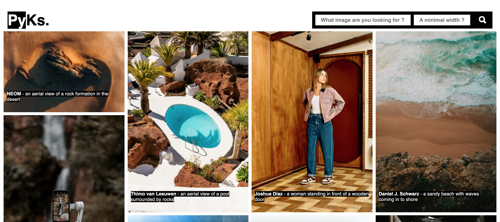

# Le projet : Gallerie photo
**#React #Javascript #UnsplashAPI #Masonry**
## Instructions
- Utiliser l'API d'Unsplash pour récupérer les photos.

- Créer une application React. Dedans, l'utilisateur se retrouvera face à un champ de texte où il pourra faire des recherches d'images par thème.

- Il y aura également un second input, dans lequel l'utilisateur pourra entrer un chiffre. Au submit, seules les images ayant une largeur supérieure au chiffre indiqué par l'utilisateur seront affichées.

- Le nombre maximal d'images à afficher sera de 20. Mais l'utilisateur aura la possibilité de cliquer sur un CTA See more. Permettant d'afficher 20 images de plus. Sous chacune des images, le nom et le prénom du photographe seront affichés, ainsi qu'une description de la photo.

- Par défaut, au premier chargement, quand rien n'a encore été écrit dans le champ de texte, les images montrées seront des images ayant le mot-clé ~~"JavaScript"~~.

- Au clic sur une image, celle-ci s'affichera en grand, avec une croix pour fermer la modale ainsi ouverte.